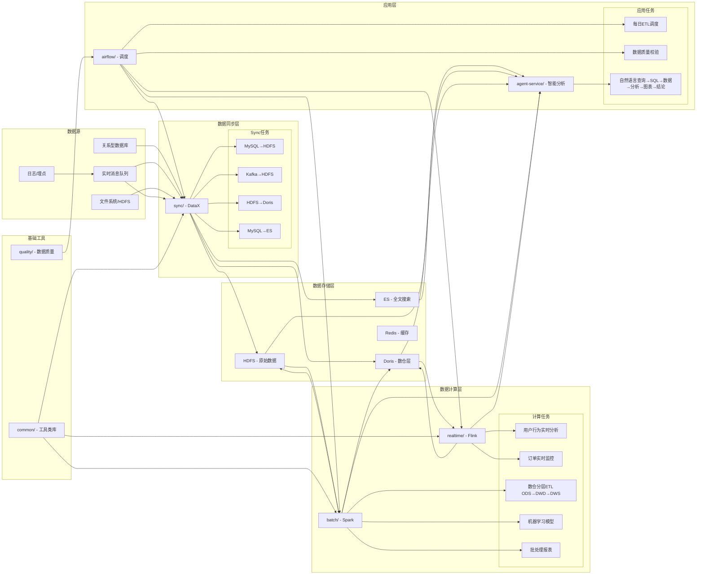

# 🎯 大数据平台各服务关系

## 🌊 数据流向视角



## 🧩 模块关系详情

### 1. 「数据同步层 (sync/)」是数据入口

| 关系 | 说明 |
|------|------|
| ⬅️ 上游 | MySQL 业务数据库、Kafka 实时数据流、文件、日志等 |
| ➡️ 下游 | HDFS（原始数据持久化）、Doris（数仓层）、Elasticsearch（全文检索） |
| ↔️ 平级 | `airflow/` 每日调度同步任务 |
| 🔧 工具依赖 | `common/` 的数据库连接、日志、错误处理工具 |

**定位**: 所有外部数据到大数据平台的入口。负责把异构数据源同步到统一的存储层，是计算层的前置步骤。

### 2. 「计算层 (realtime/ + batch/)」是数据加工厂

#### Flink 实时计算 (realtime/)
| 关系 | 说明 |
|------|------|
| ⬅️ 上游 | Kafka（实时流）、Doris（准实时数据） |
| ➡️ 下游 | Doris（数仓层 DWS/ADS）、Redis（实时缓存指标） |
| ↔️ 平级 | `airflow/` 实时任务监控与异常恢复 |
| 🔧 工具依赖 | `common/` 的 KafkaUtils、JSONUtils、配置加载工具 |

**定位**: 秒级延迟实时分析，处理高并发、低延迟数据流，输出实时报表/告警/指标。

#### Spark 离线计算 (batch/)
| 关系 | 说明 |
|------|------|
| ⬅️ 上游 | HDFS（ODS 原始数据）、Doris（DWD 明细层） |
| ➡️ 下游 | Doris（DWS/ADS 汇总层）、HDFS（中间结果） |
| ↔️ 平级 | `airflow/` 每日调度离线 ETL |
| 🔧 工具依赖 | `common/` 的 DBUtils、配置工具 |

**定位**: 批量数据处理，数仓分层 ODS→DWD→DWS→ADS，处理 TB 级以上数据，支持复杂计算。

### 3. 「应用层 (airflow/ + agent-service/)」是最终出口

#### Airflow 调度编排 (airflow/)
| 关系 | 说明 |
|------|------|
| ↔️ 平级 | `sync/` 每日同步任务调度、`batch/` 每日 ETL 调度、`quality/` 数据质量校验调度 |
| ➡️ 控制 | 通过 DAG 控制任务依赖、并发、失败重试 |
| 🔧 工具依赖 | `common/` 的自定义 Operator、工具类 |

**定位**: 平台所有任务的大脑，负责调度编排、依赖管理、监控告警、全链路数据流程控制。

#### Data Analysis Agent (agent-service/)
| 关系 | 说明 |
|------|------|
| ⬅️ 上游 | Flink 实时结果、Spark 离线数据、Doris 数仓、HDFS 原始数据、ES 搜索数据 |
| ↔️ 平级 | `airflow/` 可定时触发 Agent 生成日报；`quality/` 嵌入到 Agent 的分析流程 |
| 🔧 工具依赖 | `common/` 的 SQL 工具、JSON 工具（如果接入的话） |

**定位**: 给非技术人员的自然语言查询接口，也是所有计算结果的统一分析入口。输入一句话，自动完成「查询 SQL→取数→计算→画图→业务结论」全流程。

### 4. 「基础工具 (common/ + quality/)」是基础支撑

#### 工具类库 (common/)
| 关系 | 说明 |
|------|------|
| ➡️ 下游 | `realtime/`、`batch/`、`sync/`、`airflow/`、`agent-service/` |
| 🔧 提供 | KafkaUtils、DBUtils、HDFSUtils、JSONUtils、配置管理、日志工具、错误处理等通用工具 |

**定位**: 平台公共基础设施，避免重复代码，保证各模块技术选型和实现风格统一。

#### 数据质量 (quality/)
| 关系 | 说明 |
|------|------|
| ➡️ 下游 | `airflow/` 数据质量校验任务、`agent-service/` 分析过程中的数据质量检查 |
| 🔧 提供 | GE (Great Expectations) 校验配置、Schema 一致性检查、元数据采集 |

**定位**: 保证全链路数据质量，拦截脏数据，监控数据漂移，确保分析结果准确可信。

## 📋 总结关系口诀

```
数据源→sync进→hdfs存
hdfs→batch算→doris存
kafka→realtime算→doris存
batch+realtime→doris出→业务用
airflow调所有
agent查所有
doris数仓是核心
common质量支撑着
```

每个模块各司其职又紧密协作：
- sync 负责把数据从各处搬到平台里
- realtime/batch 负责加工数据
- doris/hdfs/es 负责存数据
- airflow 负责管任务
- agent 负责让用户用自然语言查询所有数据
- common 负责给所有模块提供通用工具
- quality 负责给所有数据保驾护航

## 🎯 模块依赖优先级

| 优先级 | 模块 | 说明 |
|--------|------|------|
| 1. 基础层 | common/ | 其他所有模块依赖的底层工具 |
| 2. 数据入层 | sync/ | 没有数据进来，其他模块都没数据可处理 |
| 3. 数据出层 | realtime/ + batch/ | 没有计算，数据还是原始数据，产生不了业务价值 |
| 4. 数据存储层 | doris + hdfs + es | 没有存储，计算完的数据没有地方持久化 |
| 5. 应用层 | airflow/ + agent-service/ | 没有调度，计算任务跑不起来；没有 Agent，数据的使用门槛太高 |
| 6. 质量层 | quality/ | 没有质量监控，分析结果可能不准确；但平台可以先用起来再逐步补质量 |

这样的分层结构解耦了各模块，每个模块可以独立演进：比如后面可以把 Flink 换成其他实时计算框架，或者把 Spark 换成其他离线计算框架，只要保持接口和数据存储格式不变，上层应用完全感知不到变化。